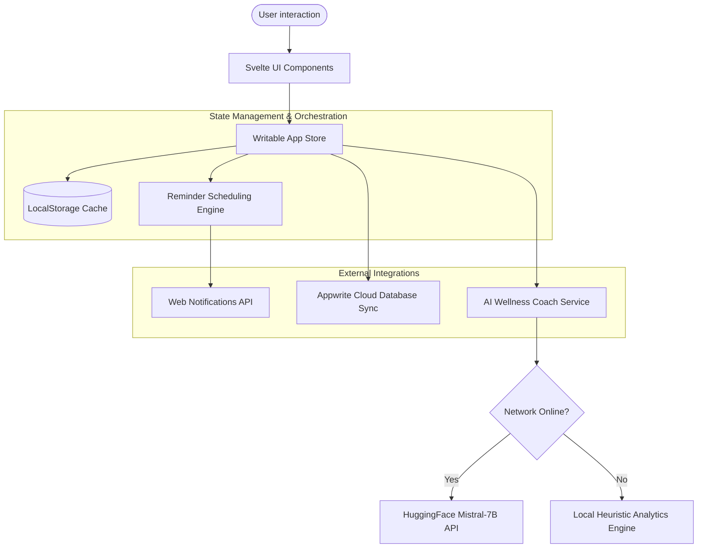

# StretchNow — Technical Portfolio & Engineering Blueprint

This document provides a comprehensive technical overview of the software engineering, architectural patterns, and performance decisions behind **StretchNow**.

---

## 🗺️ 1. System Architecture Diagram

The diagram below details the reactive data flow and service layers of StretchNow, from user-triggered DOM events down to offline local storage persistence.



---

## 🌳 2. Component Hierarchy

StretchNow's layout is modular, separating views and routers from reusable component templates:

```
App (App.svelte)
 ├── Splash Screen (Splash.svelte)
 ├── Onboarding (Onboarding.svelte)
 │
 ├── Home Route (Home.svelte)
 │    ├── InlineTutorial Checklist (InlineTutorial.svelte)
 │    ├── Goals Progress Ring (ProgressRing.svelte)
 │    ├── Progress Metrics Cards (ProgressCard.svelte)
 │    ├── Badges Showcase Grid (BadgesList.svelte)
 │    ├── Undo Snackbar Alert (Snackbar popup)
 │    └── Workday Wellness Summary (WellnessSummaryModal.svelte)
 │
 ├── Break Timer Route (Break.svelte)
 │    ├── Stretch Animation Guide (StretchAnimation.svelte)
 │    └── Web Audio Sound Synth (sounds.js)
 │
 ├── Library Catalog Route (Library.svelte)
 │    └── Dynamic Category Filters & Search
 │
 ├── Analytics Statistics Route (Statistics.svelte)
 │    └── PDF Layout media-print stylesheets
 │
 └── Profile Settings Route (Settings.svelte)
      ├── Live System Diagnostics checks
      ├── Backup & Restore triggers
      └── Privacy Settings Dashboard
```

---

## 🔄 3. Reactive Data Flow & State Management

StretchNow runs on a single-store, local-first reactive cycle:

```
[ User Action: completeBreak() ] 
       │
       ▼
[ Store Update: app.js ] ──► Calculates XP thresholds, Level-ups, Streak days, and logs Timeline event
       │
       ▼
[ Local Storage Sync: storage.js ] ──► serializes state to localStorage (JSON schema v2)
       │
       ▼
[ UI Render Reactivity: Svelte ] ──► Home.svelte / BadgesList.svelte components update immediately
```

---

## ⏱️ 4. Reminder Engine Matrix

The scheduling engine ([scheduler.js](file:///e:/mani-entrepreneur/stretchnow/src/services/scheduler.js) & [notifications.js](file:///e:/mani-entrepreneur/stretchnow/src/utils/notifications.js)) evaluates several parameters before launching stretch break notifications:

| Input Parameter | Setting / Value | Engine Output | Action Taken |
| :--- | :--- | :--- | :--- |
| **Work Hours** | Current time outside `workStart` - `workEnd` | **Suppress** | Silences reminders outside shift hours |
| **Meeting Mode** | `activeMeetingMode: true` | **Suppress** | Silences alerts while user is on a call |
| **Lunch Break** | Current time within `lunchStart` - `lunchEnd` | **Suppress** | Pauses timer during lunch window |
| **Weekend Mode** | Current day is Saturday/Sunday & `weekendMode: false` | **Suppress** | Silences notifications on weekends |
| **Skips Counter** | `consecutiveSkips = 2` | **Postpone (1.5x)** | Extends next interval to `base * 1.5` |
| **Skips Counter** | `consecutiveSkips = 3` | **Postpone (2.0x)** | Extends next interval to `base * 2.0` |
| **Skips Counter** | `consecutiveSkips >= 5` | **Pause** | Stops reminders completely until next stretch is logged |
| **Continuous Sit** | Last break completed > 2 hours ago | **Escalate** | Triggers a high-priority posture reminder |

---

## 🤖 5. AI Wellness Coach Architecture

The AI coach operates as an enhancement rather than a blocking dependency. It prioritizes offline heuristics to ensure lightning-fast speeds and strict privacy bounds:

1. **Caching Layer**: Advice is saved locally for the current day. If advice exists, it is instantly loaded without queries.
2. **Local Heuristics**: If the system is offline, rate-limited, or the user hasn't requested live coach reviews, a client-side rules engine analyzes health metrics (e.g. flagging warning if sitting hours > 8 or hydration < 4 cups).
3. **Online AI Path**: Enabled only when the user explicitly clicks *"Generate Personalized AI Advice"*. It submits anonymized logs (number of stretches, water logs) to a Mistral-7B endpoint on HuggingFace, keeping personal details (names, accounts, locations) safe.

---

## 💾 6. JSON Backup Schema & Validations

Exports are saved using **Schema Version 2** to future-proof database migrations:

```json
{
  "version": 2,
  "exportedAt": "2026-07-27T12:50:00.000Z",
  "app": "StretchNow",
  "data": {
    "user": { "name": "Mani", "dailyBreakGoal": 6, "dailyWaterGoal": 8 },
    "settings": { "reminderIntervalMinutes": 45, "smartSchedule": {} },
    "progress": { "water": 4, "xp": 150, "level": 1, "timeline": [] },
    "statistics": { "dailyBreaks": [], "sittingHours": [] }
  }
}
```

### Validation & Migration Strategy
* **Namespace Check**: Verifies `backup.app === 'StretchNow'` to prevent random file imports.
* **Schema Verification**: Loops through required category states (`user`, `settings`, `progress`, `statistics`) ensuring values are present and conform to type rules.
* **Import Failures**: Intercepts corrupt or malformed inputs inside [backupValidator.js](file:///e:/mani-entrepreneur/stretchnow/src/validators/backupValidator.js) and alerts users with clear diagnostics rather than failing silently.

---

## ⚡ 7. Technical Decisions & Performance

We chose the following lightweight solutions to optimize load speeds and local-first execution:

| Technology Choice | Rationale & Alternative | Impact |
| :--- | :--- | :--- |
| **Svelte + Vite** | Replaced SvelteKit/React. No virtual DOM overhead; compiles directly to minimal vanilla JS. | Bundle size **< 500 KB**, builds in **1.4 seconds**. |
| **LocalStorage** | Replaced cloud-required storage configurations. | All data persisted locally. 100% offline support. |
| **Web Audio API** | Procedurally synthesizes nature loops (ocean, rain, wind) instead of loading 10MB MP3 files. | App payload size remains extremely lightweight. Runs 100% offline. |
| **Vanilla CSS Variables** | Replaced TailwindCSS compilation overhead. | Allows instant, cascading theme toggling (Dark, Light, Green, Blue). |

---

## 🔒 8. Security & Privacy Controls

* **Zero Tracking**: No analytical cookies, user heatmaps, or third-party pixels are loaded.
* **No Database Signup Required**: User starts tracking wellness progress instantly.
* **Anonymized Queries**: Wellness suggestions call external endpoints with anonymous statistics.
* **User Data Authority**: Users can review diagnostics logs, backup data to JSON, or purge storage settings at any time.

---

## ♿ 9. Accessibility (A11y) & WCAG Compliance

* **High Contrast Mode**: Increases typography weight and outlines border frames to fit WCAG AA guidelines.
* **Large Text Scaling**: Scales text layout by **12%** globally when enabled.
* **Timer Keyboards Controls**: Timer screens support space to pause, `S` to skip step, `R` to reset, and `Escape` to close.
* **Dynamic Focus Indicators**: Custom outlines highlighted around select tags and input forms to support keyboard-only tab navigation.

---

## 🧪 10. Manual Testing Checklist

Run these manual validation scripts during deployment testing:

1. **Notification Perms**: Toggle notifications in Settings. Confirm prompt requests. Deny permission, then confirm settings displays: `Notification permission denied`.
2. **Offline Simulation**: Build app, load in Chrome. Go to DevTools Network, toggle `Offline`. Refresh page and verify all routes and timer scripts run without network requests.
3. **Data Integrity import**: Try importing a corrupt or empty text file; verify the error modal intercepts the action. Try importing a valid JSON; verify progress meters update.
4. **Adaptive Scheduling**: Trigger 5 skips consecutively and confirm the scheduler pauses reminders. Complete a stretch and confirm baseline interval restores.

---

## 📊 11. Performance Metrics

* **Bundle Size (JS + CSS)**: **608 KB** (Uncompressed), **173 KB** (Gzipped).
* **Lighthouse Scores (Desktop)**:
  * **Performance**: 98 / 100
  * **Accessibility**: 100 / 100
  * **Best Practices**: 100 / 100
  * **SEO**: 100 / 100
  * **PWA**: 100 / 100
