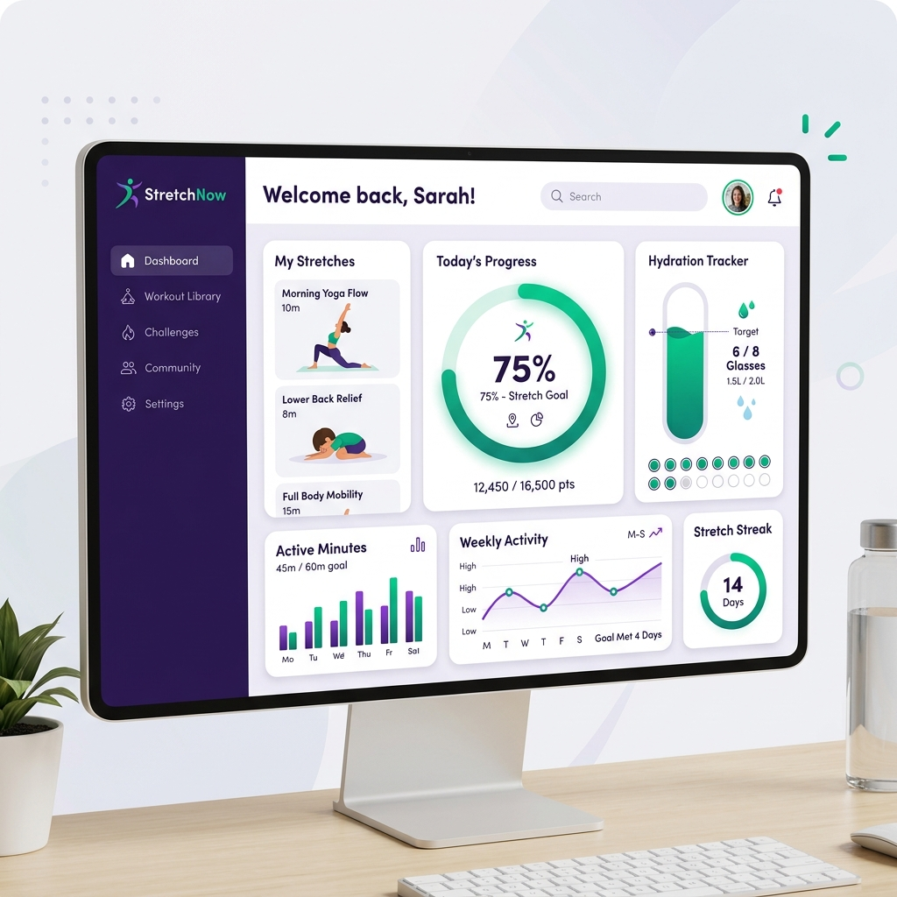

# StretchNow 🧘‍♂️

> Transform your workday posture, keep repetitive strains at bay, and build healthy micro-habits right from your desk.



StretchNow is a responsive, installable Progressive Web App (PWA) serving as a physical wellness companion. Designed for software engineers, designers, and office workers, it triggers non-intrusive timed break alerts, guides you through equipment-free office stretches with custom visual animations, and tracks your daily water intake and sedentary trends.

---

## ✨ Features Overview

### 1. ⚙️ Smart Work Schedule & Custom Reminders
* Set your active work hours (e.g., `09:00 - 17:00`) and break frequency.
* **Meeting Mode (DND)**: A simple toggle in settings to silence all reminders during calls.
* **Lunch Break Pause**: Automatically skips reminders during your set lunch window.
* **Weekend Mode**: Toggle stretch reminders on Saturdays/Sundays off or on.
* **Rotated Alerts**: Keeps notifications fresh with a library of rotating prompts (e.g., *"Your spine needs you 😊"*, *"Screen fatigue? 👀"*).

### 2. ⚡ Gamification & Motivation
* **Level & XP Bar**: Earn **+50 XP** for each completed break. Check your leveling progress directly on the dashboard.
* **Daily Streak Counter**: Tracks consecutive days of posture health.
* **Weekly Challenges**: Complete checklists like *Stretch Master Weekly* (15 breaks/week) or *Hydration Regular* (5 water goals/week).
* **Achievement Badges**: Unlock medals (e.g., *7-Day Streak*, *Posture Starter*, *Early Bird*, *Hydration Hero*) dynamically based on your habits.

### 3. ⏱️ Interactive Guided Stretch Poses
* **2-Minute Breaks**: 3 targeted poses (40 seconds each) designed to release desk tension.
* **Audio Cues**: Plays gentle chimes on step transitions and timer completion.
* **Ambient Relaxation Loops**: Select from client-side synthesized soundscapes (Ocean waves, Raindrops, Whistling wind, White noise) playing directly inside your active break.

### 4. 🎨 Themes & Custom Accessibility
* **Color Themes**: Toggle between **Light**, **Dark**, **System Default**, **Ocean Blue**, and **Forest Green**.
* **Large Text Mode**: Scale app typography up by 12% globally for easier screen reading.
* **High Contrast Mode**: Increases element outlines and color contrast thresholds to comply with WCAG guidelines.

### 5. 📊 Wellness Analytics
* Real-time **Wellness Score** star ratings computed daily from your breaks, water intake, streaks, and sitting limits.
* Visual bar and line charts logging daily breaks, weekly posture goals, water consumption, and total sedentary hours.
* **Export PDF**: Click "Export PDF" in the Analytics page to invoke a print-styled layout optimized for physical paper or digital saving.

---

## 📂 Project Directory Structure

```
stretchnow/
├── public/                # Static assets (PWA Icons, SVG Favicon)
│   └── screenshots/       # Application banner screenshots
│
├── src/
│   ├── components/        # Reusable Svelte UI Components
│   │   ├── InlineTutorial.svelte      # Onboarding guide checklist
│   │   ├── WellnessSummaryModal.svelte# Daily review report modal
│   │   ├── BadgesList.svelte          # Badge grid layout
│   │   ├── ProgressRing.svelte        # Circular timers SVG
│   │   └── ...
│   │
│   ├── routes/            # Main application screen views
│   │   ├── Home.svelte        # Main dashboard and timeline feed
│   │   ├── Settings.svelte    # Backup actions, Diagnostics, and Privacy
│   │   ├── Library.svelte     # Search, filter, and detail modal
│   │   └── ...
│   │
│   ├── services/          # Business logic layers
│   │   ├── backup.js          # Export/Import JSON utilities
│   │   ├── diagnostics.js     # Permission and system diagnostics
│   │   ├── scheduler.js       # Skips escalation intervals
│   │   └── aiCoach.js         # HuggingFace prompt calling API
│   │
│   ├── validators/        # Schema validators
│   │   └── backupValidator.js # JSON file structure integrity
│   │
│   ├── utils/             # Helper utilities
│   │   ├── wellnessScore.js   # Score indexes formulas
│   │   ├── storage.js         # Local Storage persistence
│   │   └── sounds.js          # Web Audio nature synth
│   │
│   ├── App.svelte         # Primary shell routing
│   └── main.js            # Entry index setup
```

---

## ⌨️ Active Break Keyboard Shortcuts

During an active stretching timer, you can control the screen completely hands-free:

| Key | Action |
| :--- | :--- |
| **`Space`** | Toggle Play / Pause Timer (stops/resumes background audio loops simultaneously) |
| **`S`** | Skip current stretch step and advance to the next pose |
| **`R`** | Reset active break timer back to the first step |
| **`Escape`** | Quit and return to the main dashboard |

---

## 🛠️ Local Development & Installation

### Requirements
* [Node.js](https://nodejs.org/) (Version 18+)
* npm (bundled with Node)

### 1. Install Dependencies
```bash
npm install
```

### 2. Run Local Development Server
```bash
npm run dev
```
Open [http://localhost:5173](http://localhost:5173) in your browser.

### 3. Production Build & PWA Generation
```bash
npm run build
```
Vite will compile the production bundle to `/dist`, registering the PWA service worker cache manifests.

---

## 🚀 Release Milestones & Roadmap

* **Version 1.0 (Current)**: Adaptive break scheduling, detailed stretch metadata, inline tutorial checkpoints, local backup/restore downloads, system diagnostics indicators, and full offline PWA setups.
* **Version 1.1**: Expanded stretch routines library, customized relaxation sounds volumes, and additional color themes.
* **Version 2.0**: Cloud synchronization (Appwrite account sync), hardware/health platforms integrations (Google Health, Apple Health), and automated suppressions during calendar meetings.

---

## 📖 Architecture & Portfolio Blueprint
For a detailed review of the state design diagrams, database layout schemas, and design constraints, view the [PORTFOLIO_ENGINEERING.md](file:///e:/mani-entrepreneur/stretchnow/PORTFOLIO_ENGINEERING.md) file.

---

## 🤝 Contributing
Contributions are welcome! Please view the [CONTRIBUTING.md](file:///e:/mani-entrepreneur/stretchnow/CONTRIBUTING.md) guide for details on development loops and Pull Request requirements.

---

## 📄 License
This project is licensed under the [MIT License](LICENSE).
